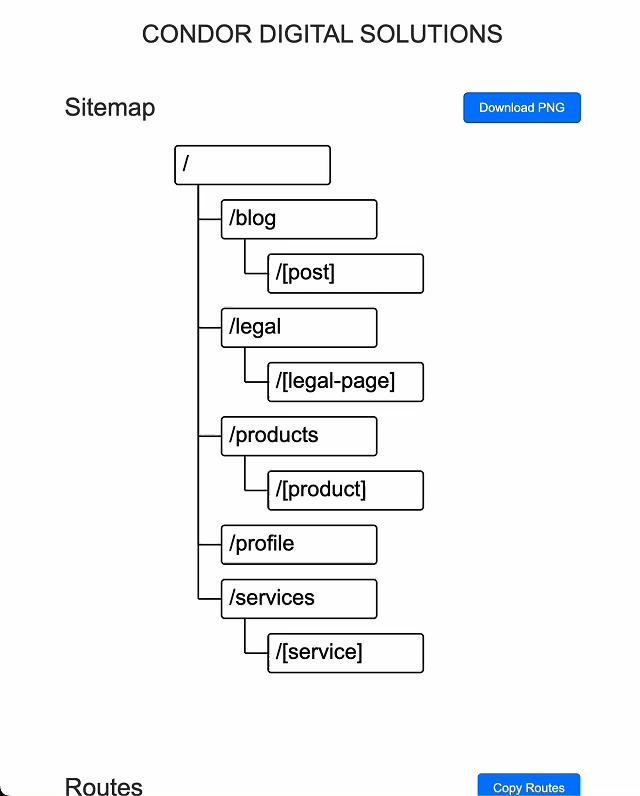
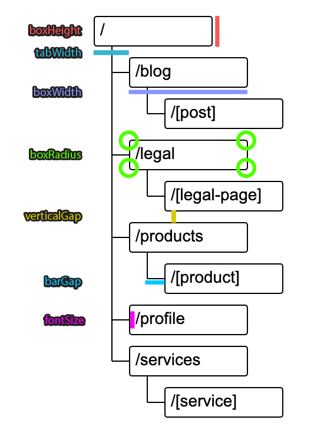

# create-next-sitemap-docs

Generate detailed sitemap documentation for your Next.js projects that use the app router. This tool creates a comprehensive HTML file featuring a visual map of your routing architecture along with detailed route documentation. It is designed to maintain scalable documentation compatible with the app router by leveraging the same system and requiring users to have a `page.md` or `route.md` file in the same directory as their Next.js `page` or `route` files. Ideal for both small projects and large applications, `create-next-sitemap-docs` helps you visualize and maintain your app's routing structure effectively.



## Usage

### Using npx

You can use the tool directly without installation via `npx`:

```sh
npx create-next-sitemap-docs
```

Running the command without parameters in the root of your Next.js project will create a sitemap at `./docs/sitemap.html`.
You can also change the input and output paths using the `--appPath` and `--outputPath` options.

### Recommended Method: Adding to package.json Scripts

The recommended way to use this tool is by adding it to the `scripts` section of your `package.json`. This allows you to easily run the tool as part of your project's workflow.

#### Example of Adding to package.json with Additional Parameters

```json
{
  "scripts": {
    "generate:sitemap": "npx create-next-sitemap-docs --pageTitle \"CONDOR DIGITAL SOLUTIONS\""
  }
}
```

#### Running the Script

After adding the script to your `package.json`, you can run it using:

```sh
npm run generate:sitemap
```

or

```sh
yarn generate:sitemap
```

### Command Line Usage

When you run the tool from the command line, it will recursively search through the directory specified in `--appPath` (./app or ./src/app by default) to find all `page` and `route` files used by the Next.js app router (`page.tsx`, `page.jsx`, `page.js`, `route.tsx`, `route.jsx`, `route.js`). Once it identifies these files, it generates an HTML file that visually maps out the routing architecture of your application. This visual map helps in understanding the structure and flow of your app's routes.

### Markdown Documentation

For each `page` or `route` file, if there is a corresponding `page.md` or `route.md` file in the same directory, the tool will automatically include the content of these markdown files in the generated HTML documentation. This ensures that the visual representation of the routing architecture is accompanied by detailed and specific documentation, making it easier to understand and navigate your codebase.

If the `onlyMarkdownFiles` option is set to `true`, only the routes or pages that have a corresponding `.md` file will be documented. If set to `false` (the default), the tool will use the entire content of the route file (e.g., `page.tsx`) in the documentation, ensuring that all routes are included even if no markdown file is present.

### Config Options

| Option                | Type    | Default                             | Description                                                        |
| --------------------- | ------- | ----------------------------------- | ------------------------------------------------------------------ |
| `--appPath`           | String  | Current working directory           | Path to the Next.js app directory.                                 |
| `--outputPath`        | String  | `sitemap.html` in current directory | Path where the generated HTML file will be saved.                  |
| `--pageTitle`         | String  | `Next App Map`                      | Title for the generated HTML page.                                 |
| `--onlyMarkdownFiles` | Boolean | `false`                             | If `true`, only includes routes that have corresponding .md files. |

### SVG Options



| Option          | Type   | Default | Description                                  |
| --------------- | ------ | ------- | -------------------------------------------- |
| `--fontSize`    | Number | 28      | Font size for the SVG graph text.            |
| `--boxWidth`    | Number | 200     | Width of each box in the SVG graph.          |
| `--boxHeight`   | Number | 50      | Height of each box in the SVG graph.         |
| `--boxRadius`   | Number | 4       | Border radius of each box in the SVG graph.  |
| `--tabWidth`    | Number | 60      | Width of the tabs in the SVG graph.          |
| `--verticalGap` | Number | 20      | Vertical gap between boxes in the SVG graph. |
| `--barGap`      | Number | 30      | Gap between bars in the SVG graph.           |

## Example

```sh
npx create-next-sitemap-docs --appPath "./src/app" --outputPath "./docs/sitemap.html" --pageTitle "CONDOR DIGITAL SOLUTIONS" --boxHeight 100
```

This will generate an HTML documentation file containing a comprehensive sitemap with a visual map of your routing architecture. It will include a downloadable PNG graph and detailed route documentation from any accompanying `.md` files, providing a clear and complete overview of your app's routing structure.

## License

ISC

## Contributing

Feel free to open issues or submit pull requests on [GitHub](https://github.com/JulianDM1995/create-next-sitemap-docs).
