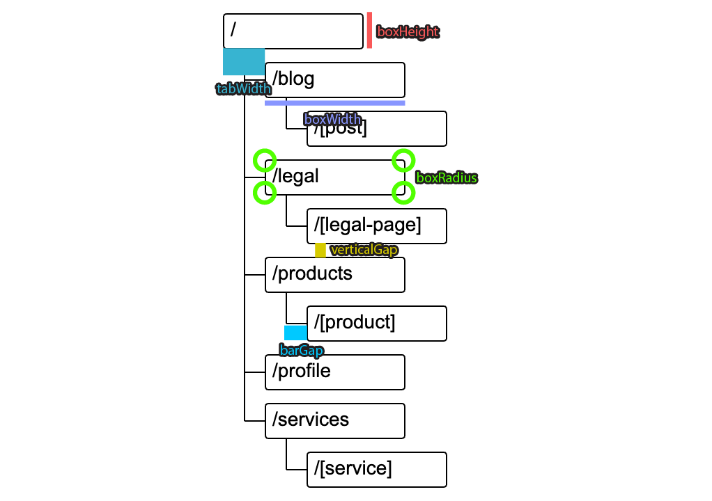

# create-next-sitemap-docs

Generate sitemap documentation for Next.js projects including a downloadable SVG graph, route map with .md documentation, and support for app router.



## Installation

You can install this package via npm:

```sh
npm install -g create-next-sitemap-docs
```

Or use it directly with `npx`:

```sh
npx create-next-sitemap-docs --appPath "./src/app/" --outputPath "./docs"
```

## Usage

### CLI Options

| Option                | Type    | Default                             | Description                                                        |
| --------------------- | ------- | ----------------------------------- | ------------------------------------------------------------------ |
| `--appPath`           | String  | Current working directory           | Path to the Next.js app directory.                                 |
| `--outputPath`        | String  | `sitemap.html` in current directory | Path where the generated HTML file will be saved.                  |
| `--pageTitle`         | String  | `Next App Map`                      | Title for the generated HTML page.                                 |
| `--fontSize`          | Number  | 28                                  | Font size for the SVG graph text.                                  |
| `--boxWidth`          | Number  | 200                                 | Width of each box in the SVG graph.                                |
| `--boxHeight`         | Number  | 50                                  | Height of each box in the SVG graph.                               |
| `--boxRadius`         | Number  | 4                                   | Border radius of each box in the SVG graph.                        |
| `--tabWidth`          | Number  | 60                                  | Width of the tabs in the SVG graph.                                |
| `--verticalGap`       | Number  | 20                                  | Vertical gap between boxes in the SVG graph.                       |
| `--barGap`            | Number  | 30                                  | Gap between bars in the SVG graph.                                 |
| `--onlyMarkdownFiles` | Boolean | `false`                             | If `true`, only includes routes that have corresponding .md files. |

## Example

```sh
npx create-next-sitemap-docs --appPath "./src/app/(webapp)" --outputPath "./scripts/sitemap.html" --pageTitle "CONDOR DIGITAL SOLUTIONS"
```

This will generate an HTML file with a sitemap including a downloadable SVG graph, a route map with .md documentation, and support for the app router.

## License

ISC

## Contributing

Feel free to open issues or submit pull requests on [GitHub](https://github.com/JulianDM1995/create-next-sitemap-docs).
